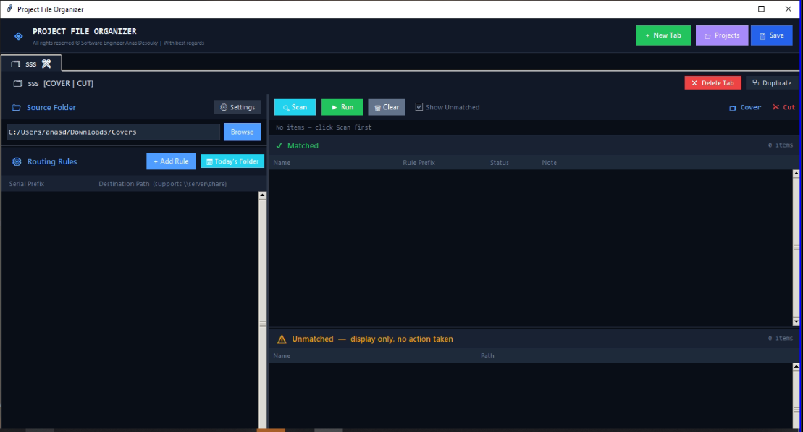

# Intelligent File Routing & Network Transfer Engine

Desktop tool for Document Control that scans incoming submittals (PDFs, folders, archives), determines the correct project folder from the serial number, and transfers them to network drives (UNC), handling tens of thousands of files.

## ⚠️ Repository Note
*This repository serves as a portfolio showcase of the architectural logic, custom UI virtualization, and network optimization techniques. The proprietary Python source code is withheld to protect intellectual property.*

## 🚧 The Problem
In massive construction projects, sorting daily incoming documents (PDFs, Folders, Archives) into their corresponding project directories on remote servers is a nightmare.
1. **Network Overhead:** Transferring thousands of tiny files individually across a corporate network is agonizingly slow.
2. **Windows Path Limits:** Deeply nested engineering folders constantly hit the Windows 260-character `MAX_PATH` limit, causing silent transfer failures.
3. **Human Error:** A single typo in a file's serial number can send it to the wrong project directory, losing the document forever.
4. **UI Freezing:** Loading 100,000+ files into a standard desktop GUI crashes the application.

## 💡 The Solution & Core Features

### 1. Smart Routing & Heuristic Parsing
* **Auto-Prefix Deduction:** Users can paste a full, complex serial number (e.g., `ABC-PRJ-XYZ-IR-P01-ARCH-00123-00`), and the engine heuristically strips trailing numeric/revision tokens to deduce the strict routing prefix automatically.
* **Fuzzy Typo Detection (Levenshtein):** Implements the Levenshtein distance algorithm to detect if a scanned file *almost* matches a project's rules (e.g., `P06` vs `P07`). Instead of failing silently, it flags the file for "Human-in-the-loop" review.

### 2. Network-Optimized Payload Transfer
* **ZIP Batching Mode:** To bypass network latency, the engine groups files by rule, zips them locally into a single payload, transfers the archive to the remote server, extracts it dynamically handling any file conflicts, and cleans up.
* **Native `MAX_PATH` Bypass:** Transparently prefixes deep network paths with `\\?\UNC\` to natively bypass Windows' 260-character limitation without requiring registry edits or Admin rights.

### 3. Custom UI Virtualization (High Performance)
* **VirtualList Rendering:** Engineered a custom canvas-based virtual scrolling list (`VirtualList`). It renders *only* the rows currently visible on the screen (+ a small buffer), allowing the UI to handle 100,000+ items smoothly with near-zero memory bloat.
* **Asynchronous Architecture:** All heavy I/O scanning and transferring operations run on isolated daemon threads, streaming live updates to a custom Progress Window via event queues.

## 🛠 Tech Stack & Architecture
* **GUI Framework:** `tkinter` & `ttk` heavily customized for a dark-mode, modern aesthetic.
* **Concurrency:** `threading` and `Event` locks for safe pause/cancel mid-execution.
* **Algorithms:** Levenshtein string matching, Heuristic Token Parsing.
* **File Systems:** Advanced `pathlib` and `shutil` operations, `zipfile` for byte-streaming, and explicit UNC network routing.

## 📸 Interface Preview

